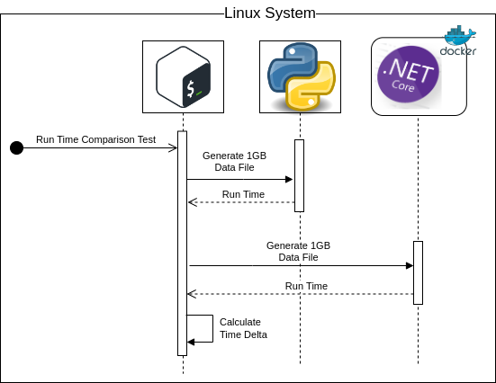

## Visual Overview

## System Requirements

Linux/Ubutu, Bash, Python, Docker, .Net Core (C#)

## Background -- How slow is Python, and is "everything Microsoft" bad?

I love Python.  It is slow, though.  Just how slow is it compared to other languages?  -- In this case we compare it to .Net Core / C#.

It comes as no news to many that Windows is not a good platform for the development of serious systems.

It's expensive to license, its internals are clunky, its architecture is archane, its security is poor, and its interfaces are proprietary and non-standard.

MacOS is a little better, but it's still not as clean as Linux, and its the M1/M2 chips do not always play well with industry standard libraries.

By contrast, Linux / BDS etc, are beautiful systems.  Not withstanding their quirks they are efficient, lightweight, and power the internet, big data, the internet of things, and now, Data Science AI, and ML.

Some of Microsoft's offerings are not without their benefits.  .Net Core (Open source .Net Framework that runs on Linux) is arguable a better platform than Java, in that it is fast, does not rely on a runtime, and is less bloated.  -- Best of all, it is free.

## The Punchline

The Python and C# program both generate files that are 1GB in size and contain approximately 18 million records.

The code is simple, and optimized, with a time complexity of O(n / s), with s being a constant average row size. 

Python is running on the system, C# is running within a docker container.

The python code takes **more than three times** as long to complete compared to the C# code.

This test is simple.  More complicated identical tasks I have run, show that the time delta between the two languages is even more extreme.  I.E. generating thousands of Excel documents may take 3 hours or more in Python, while it may take 5-10 minutes in C#.

## The Sequence

With this very simple project, we generate a data file that is 1GB large with Python

We then generate the exact same data file using C# (Running within a docker container so as not to complicate our systems deployments).

